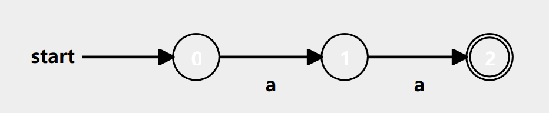
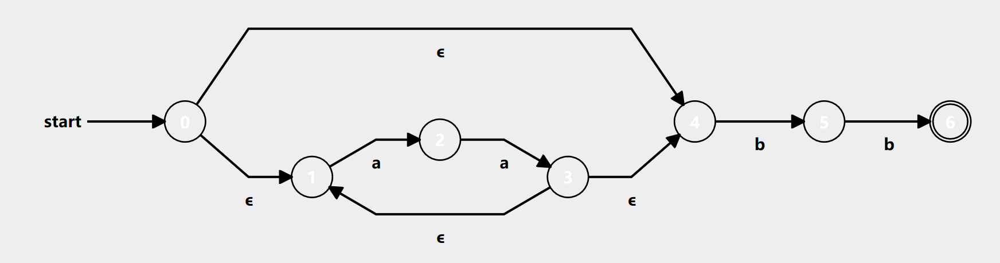

# NARR

### **N**FAs **A**re **R**eally **R**ad

Turing Completeness is overdone, let's get back to basics with Regular
Languages and FSAs!

## What is this?

NARR is an esoteric language designed to simulate NFAs. NARR is **not** Turing
Complete due to it only being able to represent Regular Languages, which are a
few steps below Recursively Enumerable languages in [Chomsky's Hierarchy
](https://en.wikipedia.org/wiki/Chomsky_hierarchy).

## Wait, but why?

Why not? Esoteric languages are fun! Besides that, NFA simulation is something
that confused me when I first build a regular expression to NFA converter. I've
now finally sat down to learn it and this is the spawn of that.

Also, I think this could be a good learning tool for those who are looking to
learn the theory behind computer science. FSA are important for a handful of
tools, most notably lexers for compilers.

## Syntax

NARR has a very limited and simple syntax that consists of three key constructs:
comments, transitions, and accepting states.

The following is an example of a NARR program that accepts a string of exactly
two a's
```
0=a>1
1=a>2
$2
```

The first two lines represent transitions from state 0 to state 1 when the
character 'a' is read. The last line represents a list of accepting states
(states in which if the NFA ends, will confirm the string was in the given
language).

This NFA could be drawn as:



### A more complex example

Let's say we wanted an NFA that accepts an even number of a's followed by exactly two b's

```
0=>4
0=>1
1=a>2
2=a>3
3=>1
3=>4
4=b>5
5=b>6
$6
```

This NFA could be drawn as:

